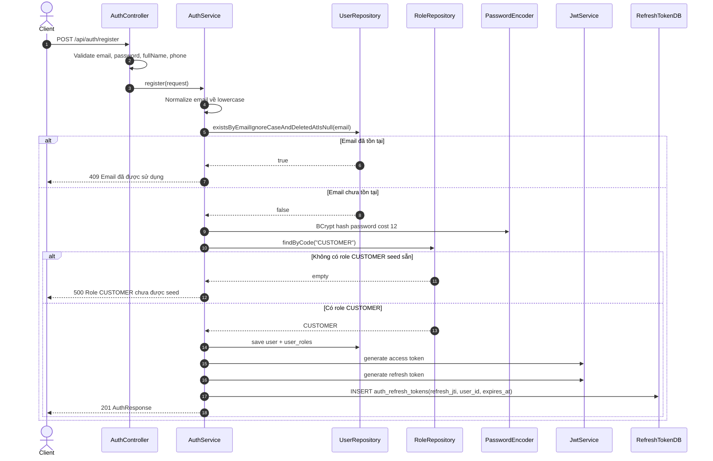
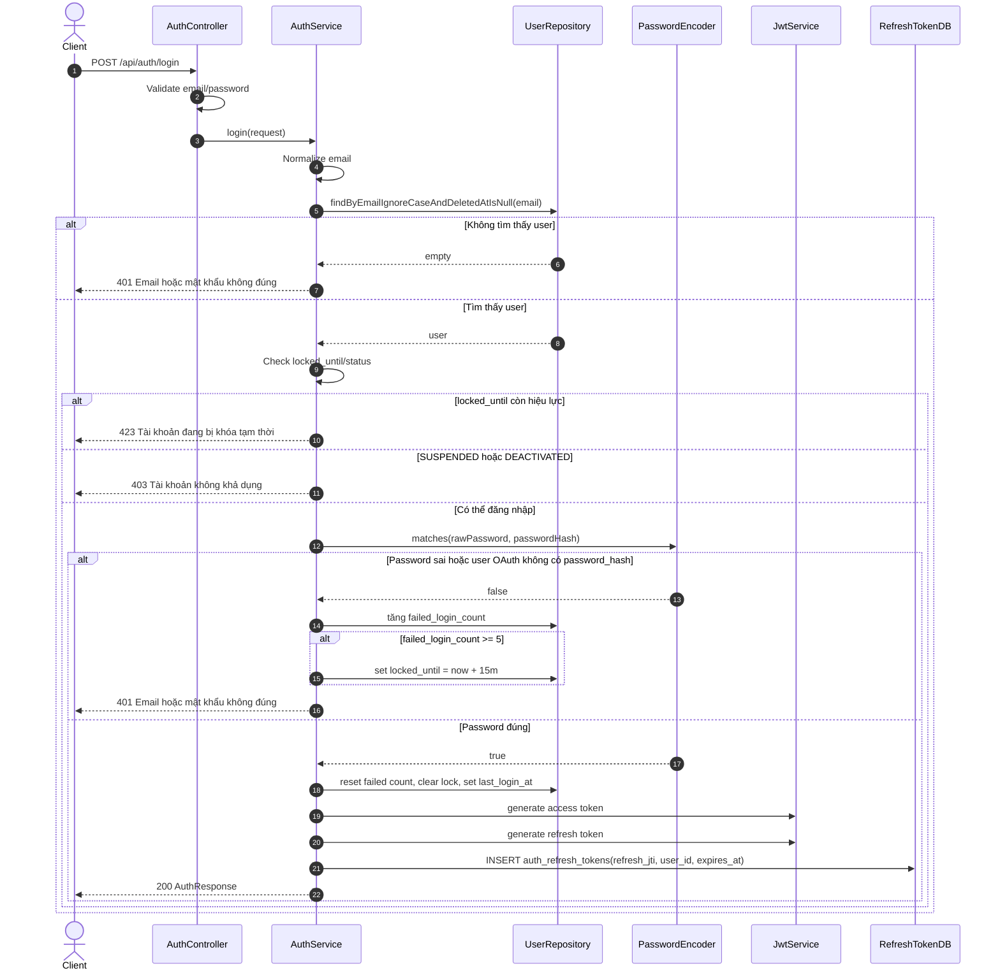
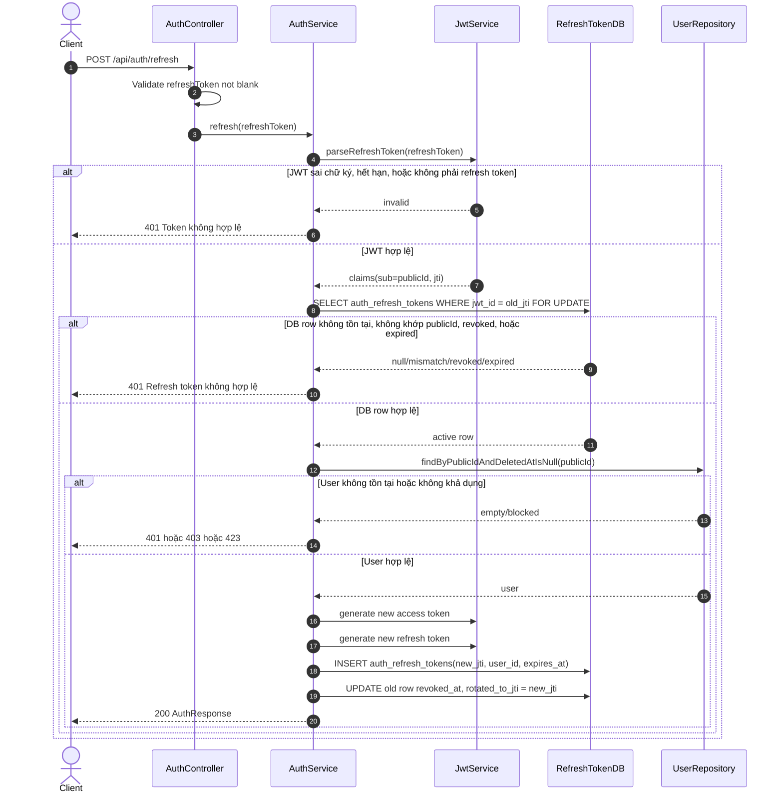
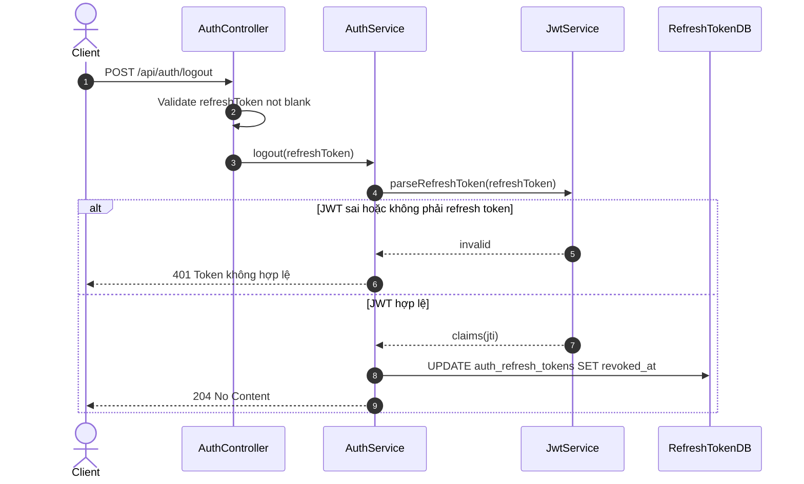
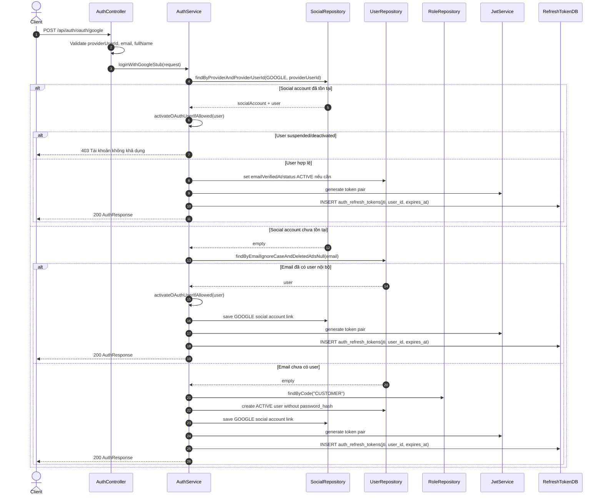
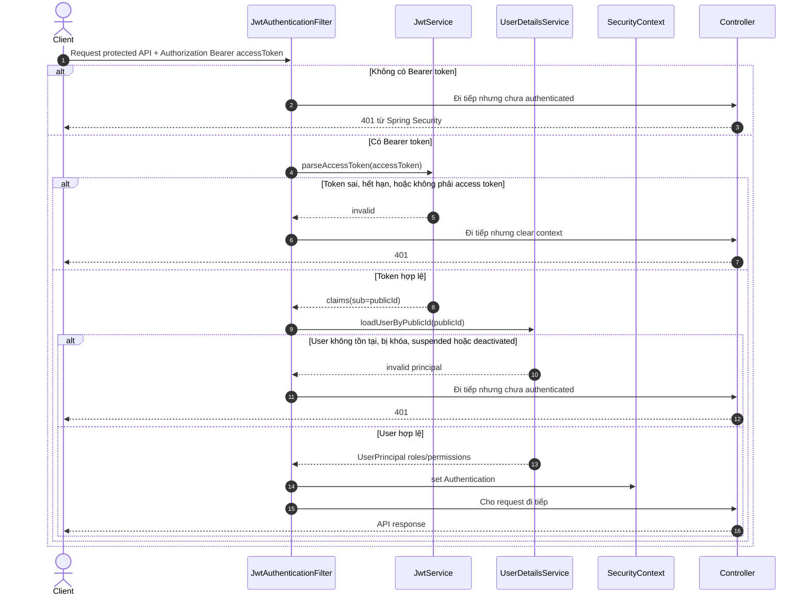

# Auth JWT + OAuth Flow

Tài liệu này mô tả flow hiện tại của BE-2.1 trong backend. Token được trả về dạng JSON Bearer: frontend lấy `accessToken` để gửi header `Authorization: Bearer <token>`, còn `refreshToken` dùng để xin cặp token mới.

OAuth Google hiện là stub cho môi trường dev: backend chưa gọi Google thật, chỉ nhận dữ liệu giả lập gồm `providerUserId`, `email`, `fullName`.

## Thành phần chính

| Thành phần | Vai trò |
| --- | --- |
| `AuthController` | Nhận request `/api/auth/**`, validate DTO và gọi service. |
| `AuthService` | Xử lý nghiệp vụ register, login, refresh, logout, OAuth stub. |
| `JwtService` | Sinh và verify JWT access/refresh token. |
| `RefreshTokenService` | Lưu, kiểm tra, revoke refresh token trong DB theo `jti`. |
| `JwtAuthenticationFilter` | Đọc access token từ header Bearer cho các API protected. |
| `users` | Lưu tài khoản, password hash, trạng thái, số lần login sai, thời điểm khóa. |
| `user_roles` / `roles` / `permissions` | Gán role và suy ra permission trả về trong token/user summary. |
| `user_social_accounts` | Lưu liên kết tài khoản OAuth với user nội bộ. |

## 1. Register

Endpoint: `POST /api/auth/register`

Các bước:

1. Controller validate dữ liệu đầu vào bằng Bean Validation.
2. Service chuẩn hóa email về lowercase để tránh `A@x.com` và `a@x.com` bị hiểu khác nhau ở tầng app.
3. Nếu email đã tồn tại và user chưa bị soft delete, trả `409`.
4. Password không lưu plaintext; backend chỉ lưu BCrypt hash cost 12 vào `users.password_hash`.
5. User mới có `status = PENDING_VERIFICATION`, vì email verification thuộc BE-2.2.
6. User được gán role `CUSTOMER` từ seed Flyway.
7. Backend sinh access token và refresh token.
8. Refresh token được lưu ở bảng `auth_refresh_tokens` bằng `jti`; đây là phần server-side revoke/validate.
9. Response trả token pair và user summary cho frontend.

Rẽ nhánh quan trọng:

- Email trùng: dừng flow, không hash password, không tạo user.
- Thiếu seed role `CUSTOMER`: báo lỗi hệ thống vì migration/seed chưa đúng.
- Register hiện vẫn trả token dù email chưa verified; frontend nhìn `user.status` để biết tài khoản đang `PENDING_VERIFICATION`.

## 2. Login

Endpoint: `POST /api/auth/login`

Các bước:

1. Controller validate email/password.
2. Service tìm user theo email, bỏ qua user đã soft delete.
3. Nếu không tìm thấy user, trả lỗi generic `Email hoặc mật khẩu không đúng` để tránh lộ email có tồn tại hay không.
4. Nếu `locked_until` vẫn ở tương lai, trả `423 Locked`.
5. Nếu tài khoản `SUSPENDED` hoặc `DEACTIVATED`, trả `403`.
6. Nếu password sai, tăng `failed_login_count`.
7. Khi sai đủ 5 lần, set `locked_until = now + 15 phút`.
8. Nếu password đúng, reset số lần sai, clear lock, cập nhật `last_login_at`.
9. Sinh token pair và lưu refresh token vào bảng `auth_refresh_tokens`.

Rẽ nhánh quan trọng:

- User OAuth không có `password_hash` không đăng nhập bằng password được.
- Access token không lưu DB; nó tự chứa chữ ký và hạn dùng.
- Refresh token phải có DB row hợp lệ mới refresh được.

## 3. Refresh Token

Endpoint: `POST /api/auth/refresh`

Các bước:

1. Backend parse refresh token bằng JWT secret.
2. Token phải có claim `typ = refresh`; access token đem đi refresh sẽ bị từ chối.
3. Backend lấy `jti` trong refresh token để kiểm tra bảng `auth_refresh_tokens`.
4. Nếu không có DB row, row không khớp user, `revoked_at` đã có giá trị, hoặc `expires_at <= now()`, token bị từ chối.
5. Nếu hợp lệ, backend giữ lock dòng cũ trong transaction để tránh refresh song song dùng cùng token.
6. Backend kiểm tra user còn tồn tại và còn được phép authenticate.
7. Sinh token pair mới, lưu refresh token mới vào DB, rồi đánh dấu token cũ `revoked_at` và `rotated_to_jti`.

Rẽ nhánh quan trọng:

- Refresh token được rotate: token cũ chỉ dùng một lần.
- Nếu user bị khóa/suspended/deactivated sau khi login, refresh sẽ bị chặn.
- Nếu DB mất row refresh token, refresh token cũ không dùng được nữa; user cần login lại.

## 4. Logout

Endpoint: `POST /api/auth/logout`

Các bước:

1. Client gửi refresh token muốn logout.
2. Backend parse refresh token để lấy `jti`.
3. Backend set `revoked_at` cho DB row có `jwt_id = jti`.
4. Response `204` nếu xóa xong.

Rẽ nhánh quan trọng:

- Logout chỉ revoke refresh token server-side.
- Access token hiện là JWT stateless nên vẫn có thể dùng đến khi hết hạn ngắn; đây là lý do access token TTL phải ngắn.
- Nếu cần revoke access token ngay lập tức, bước sau có thể thêm DB/Redis denylist theo `accessToken.jti`.

## 5. Google OAuth Stub

Endpoint: `POST /api/auth/oauth/google`

Các bước:

1. Controller validate `providerUserId`, `email`, `fullName`.
2. Service tìm liên kết `GOOGLE + providerUserId` trong `user_social_accounts`.
3. Nếu đã có liên kết, dùng user tương ứng để login.
4. Nếu user bị `SUSPENDED` hoặc `DEACTIVATED`, chặn login.
5. Nếu user đang `PENDING_VERIFICATION`, OAuth stub sẽ set `emailVerifiedAt` và chuyển `ACTIVE`.
6. Nếu chưa có social account, service tìm user nội bộ theo email.
7. Nếu email đã có user, link Google account vào user đó.
8. Nếu email chưa có user, tạo user mới `ACTIVE`, không có `password_hash`, gán role `CUSTOMER`.
9. Sinh token pair và lưu refresh token vào bảng `auth_refresh_tokens`.

Rẽ nhánh quan trọng:

- Đây là stub dev, chưa verify `id_token` với Google nên không dùng cho production.
- User tạo bằng OAuth có `password_hash = null`; họ không login bằng password được cho đến khi có flow đặt mật khẩu/reset ở BE-2.2.
- Social account unique theo `(provider, provider_user_id)`, nên cùng Google user không link lặp nhiều lần.

## 6. Access Protected API bằng Bearer Token

Luồng này áp dụng cho mọi API không nằm trong whitelist `/api/auth/**`, `/actuator/health`, Swagger/OpenAPI.

Các bước:

1. Frontend gửi access token trong header `Authorization: Bearer <accessToken>`.
2. Filter parse access token và kiểm tra chữ ký, expiry, claim `typ = access`.
3. Filter load user mới nhất từ database bằng `publicId`.
4. Nếu user không hợp lệ, request không được authenticate và sẽ bị Spring Security trả `401`.
5. Nếu user hợp lệ, filter set `Authentication` vào `SecurityContext`.
6. Controller/service phía sau có thể dùng principal, roles và permissions.

## 7. Ghi chú vận hành

- Swagger UI: `http://localhost:8080/swagger-ui/index.html`.
- OpenAPI JSON: `http://localhost:8080/v3/api-docs`.
- Trong Swagger UI, bấm `Authorize` và dán access token lấy từ login/register.
- DB row refresh token nằm trong bảng `auth_refresh_tokens`, khóa logic là `jwt_id` tương ứng claim `jti`.
- `JWT_SECRET` phải dài tối thiểu 32 bytes và lấy từ `.env`, không hardcode trong source.
- Test profile dùng H2 và tắt Flyway MySQL migration; JWT secret test nằm trong `application-test.yml`.
