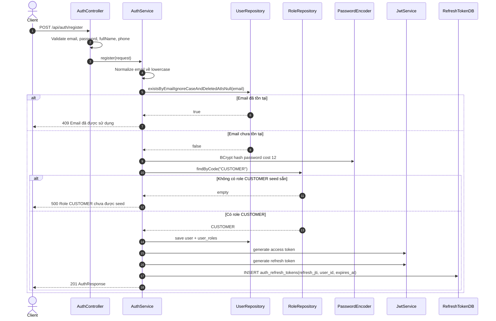
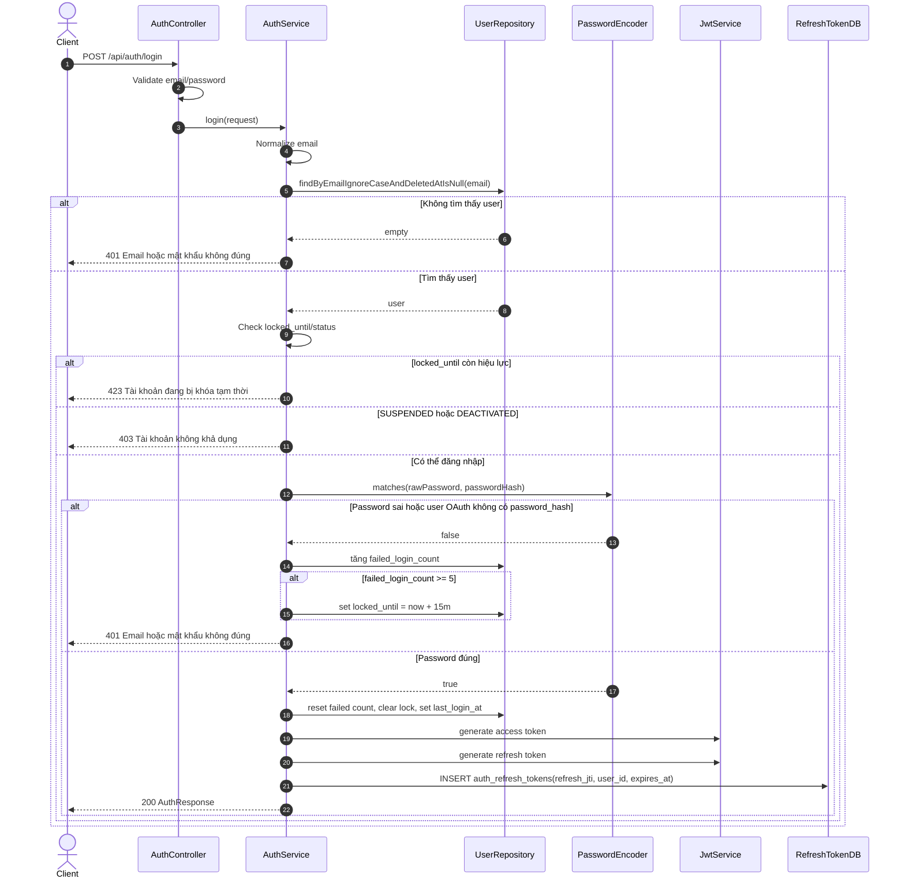
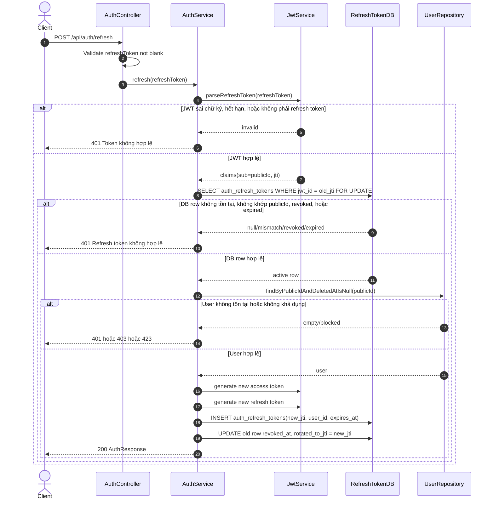
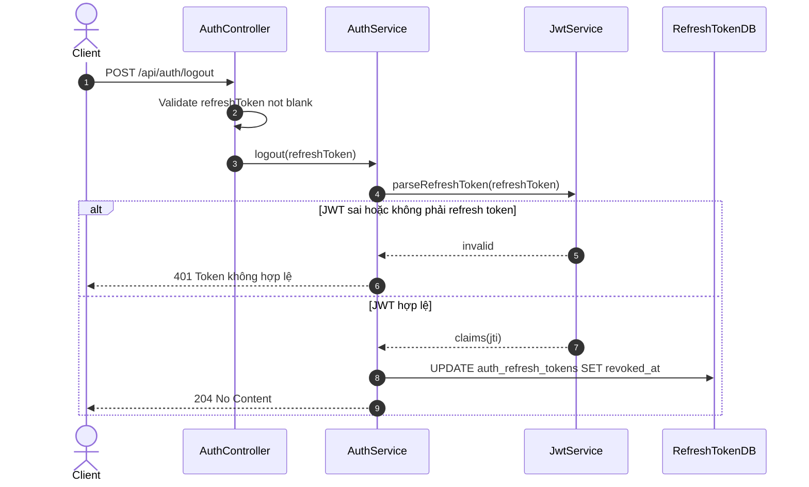
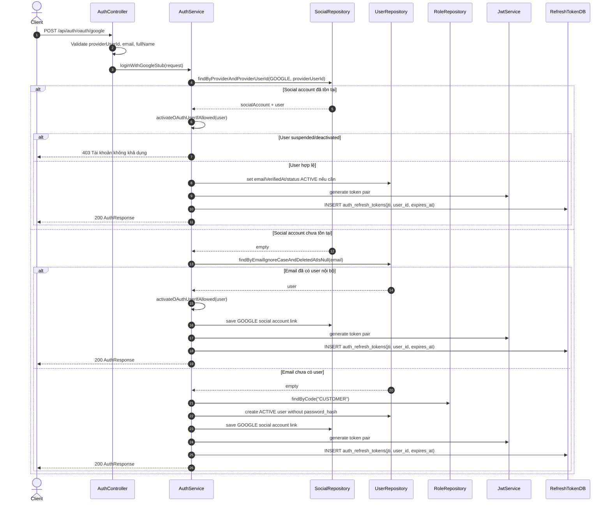
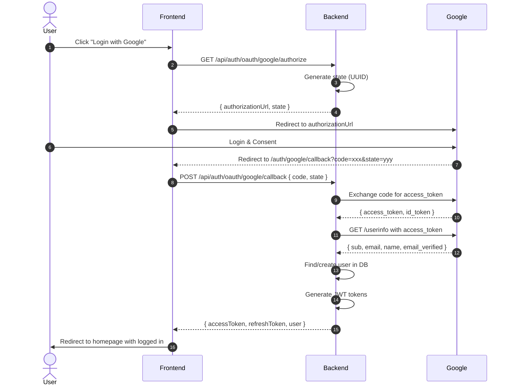
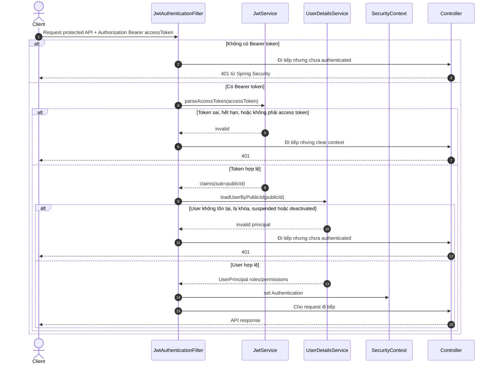

# Auth JWT + OAuth Flow

Tài liệu này mô tả flow hiện tại của hệ thống authentication. Token được trả về dạng JSON Bearer: frontend lấy `accessToken` để gửi header `Authorization: Bearer <token>`, còn `refreshToken` dùng để xin cặp token mới.

## Thành phần chính

| Thành phần | Vai trò |
| --- | --- |
| `AuthController` | Nhận request `/api/auth/**`, validate DTO và gọi service. |
| `OAuthController` | Xử lý OAuth flow với Google. |
| `AuthService` | Xử lý nghiệp vụ register, login, refresh, logout, OAuth. |
| `OAuthService` | Giao tiếp với Google OAuth API. |
| `JwtService` | Sinh và verify JWT access/refresh token. |
| `RefreshTokenService` | Lưu, kiểm tra, revoke refresh token trong DB theo `jti`. |
| `JwtAuthenticationFilter` | Đọc access token từ header Bearer cho các API protected. |
| `users` | Lưu tài khoản, password hash, trạng thái, số lần login sai, thời điểm khóa. |
| `user_roles` / `roles` / `permissions` | Lưu đúng một role hiện tại cho User và suy ra permission trả về trong token/user summary. |
| `user_social_accounts` | Lưu liên kết tài khoản OAuth với user nội bộ. |
| `OAuthProperties` | Cấu hình Google OAuth credentials từ environment. |

---

## Tại sao cần OAuth?

### Vấn đề không có OAuth
```
Người dùng muốn đăng nhập → Phải:
1. Nhớ thêm username/password mới
2. Xác minh email
3. Đặt mật khẩu đủ mạnh
→ Friction cao → User drop

Nguy hiểm:
- Lưu password trong database → Rủi ro bảo mật
- User dùng chung password với site khác → Bị hack 1 lần, hack tất cả
```

### Lợi ích của OAuth (Đăng nhập Google)
```
✓ Không cần tạo password mới
✓ Không cần xác minh email (Google đã verify)
✓ 1 click → đăng nhập ngay
✓ Bảo mật hơn (Google lo phần auth)
✓ User không cần nhớ thêm tài khoản
```

### OAuth là gì?
**OAuth 2.0** (Open Authorization) là một giao thức cho phép ứng dụng của bạn **ủy quyền** để truy cập tài khoản của user trên một dịch vụ khác (VD: Google, Facebook) **mà không cần biết password của họ**.

---

## Cấu hình Google OAuth

### 1. Tạo OAuth Client trong Google Cloud Console

1. Truy cập: https://console.cloud.google.com/
2. Chọn/tao project
3. APIs & Services → Credentials
4. Create Credentials → OAuth client ID
5. Application type: Web application
6. Name: TripStay Backend
7. **Authorized redirect URIs** (quan trọng!):
   ```
   http://localhost:8080/api/auth/oauth/google/callback
   https://your-production-domain.com/api/auth/oauth/google/callback
   ```
8. Create → Copy Client ID & Client Secret

### 2. Cấu hình Environment Variables

```bash
# Backend (.env)
GOOGLE_CLIENT_ID=123456789-abcdefghijklmnop.apps.googleusercontent.com
GOOGLE_CLIENT_SECRET=GOCSPX-xxxxxxxxxxxxx
GOOGLE_REDIRECT_URI=http://localhost:8080/api/auth/oauth/google/callback
GOOGLE_FRONTEND_CALLBACK_URL=http://localhost:3000/auth/google/callback

# Production thêm:
# GOOGLE_REDIRECT_URI=https://api.yourdomain.com/api/auth/oauth/google/callback
# GOOGLE_FRONTEND_CALLBACK_URL=https://yourdomain.com/auth/google/callback
```

### 3. OAuth Scopes

Scopes quyết định thông tin nào được phép truy cập:

| Scope | Thông tin được truy cập |
|-------|------------------------|
| `openid` | OpenID Connect authentication |
| `email` | Email address |
| `profile` | Name, profile picture, etc. | |

## 1. Register

Endpoint: `POST /api/auth/register`



Các bước:

1. Controller validate dữ liệu đầu vào bằng Bean Validation.
2. Service chuẩn hóa email về lowercase để tránh `A@x.com` và `a@x.com` bị hiểu khác nhau ở tầng app.
3. Nếu email đã tồn tại và user chưa bị soft delete, trả `409`.
4. Password không lưu plaintext; backend chỉ lưu BCrypt hash cost 12 vào `users.password_hash`.
5. User mới có `status = PENDING_VERIFICATION`, vì email verification thuộc BE-2.2.
6. User được gán đúng một role `CUSTOMER` từ seed Flyway; mọi luồng đổi role phải thay bản ghi role hiện tại, không thêm role thứ hai.
7. Backend sinh access token và refresh token.
8. Refresh token được lưu ở bảng `auth_refresh_tokens` bằng `jti`; đây là phần server-side revoke/validate.
9. Response trả token pair và user summary cho frontend.

Rẽ nhánh quan trọng:

- Email trùng: dừng flow, không hash password, không tạo user.
- Thiếu seed role `CUSTOMER`: báo lỗi hệ thống vì migration/seed chưa đúng.
- Register hiện vẫn trả token dù email chưa verified; frontend nhìn `user.status` để biết tài khoản đang `PENDING_VERIFICATION`.

### Admin tạo Staff qua invitation

Admin không nâng Customer thành Staff. `POST /api/staff-profiles` luôn tạo User mới với role duy nhất `STAFF`, tạo StaffProfile độc lập và để User ở `PENDING_VERIFICATION`. Backend gửi token `STAFF_INVITATION` dùng một lần cùng mật khẩu tạm do Admin nhập; Staff mở link để xác thực email, sau đó User chuyển sang `ACTIVE` và đăng nhập trực tiếp bằng mật khẩu trong email.

Admin có thể reset mật khẩu Staff qua `PATCH /api/staff-profiles/{employeeCode}/password`; backend không yêu cầu mật khẩu cũ và thu hồi toàn bộ refresh token hiện tại của Staff.

## 2. Login

Endpoint: `POST /api/auth/login`



Các bước:

1. Controller validate email/password.
2. Service tìm user theo email, bỏ qua user đã soft delete.
3. Nếu không tìm thấy user, trả lỗi generic `Email hoặc mật khẩu không đúng` để tránh lộ email có tồn tại hay không.
4. Nếu `locked_until` vẫn ở tương lai, trả `423 Locked`.
5. Nếu tài khoản `SUSPENDED` hoặc `DEACTIVATED`, trả `403`.
6. Nếu password sai, tăng `failed_login_count`.
7. Khi sai đủ 5 lần, set `locked_until = now + 15 phút`.
8. Nếu password đúng, reset số lần sai, clear lock, cập nhật `last_login_at`.
9. Sinh token pair và lưu refresh token vào bảng `auth_refresh_tokens`.

Rẽ nhánh quan trọng:

- User OAuth không có `password_hash` không đăng nhập bằng password được.
- Access token không lưu DB; nó tự chứa chữ ký và hạn dùng.
- Refresh token phải có DB row hợp lệ mới refresh được.

## 3. Refresh Token

Endpoint: `POST /api/auth/refresh`



Các bước:

1. Backend parse refresh token bằng JWT secret.
2. Token phải có claim `typ = refresh`; access token đem đi refresh sẽ bị từ chối.
3. Backend lấy `jti` trong refresh token để kiểm tra bảng `auth_refresh_tokens`.
4. Nếu không có DB row, row không khớp user, `revoked_at` đã có giá trị, hoặc `expires_at <= now()`, token bị từ chối.
5. Nếu hợp lệ, backend giữ lock dòng cũ trong transaction để tránh refresh song song dùng cùng token.
6. Backend kiểm tra user còn tồn tại và còn được phép authenticate.
7. Sinh token pair mới, lưu refresh token mới vào DB, rồi đánh dấu token cũ `revoked_at` và `rotated_to_jti`.

Rẽ nhánh quan trọng:

- Refresh token được rotate: token cũ chỉ dùng một lần.
- Nếu user bị khóa/suspended/deactivated sau khi login, refresh sẽ bị chặn.
- Nếu DB mất row refresh token, refresh token cũ không dùng được nữa; user cần login lại.

## 4. Logout

Endpoint: `POST /api/auth/logout`



Các bước:

1. Client gửi refresh token muốn logout.
2. Backend parse refresh token để lấy `jti`.
3. Backend set `revoked_at` cho DB row có `jwt_id = jti`.
4. Response `204` nếu xóa xong.

Rẽ nhánh quan trọng:

- Logout chỉ revoke refresh token server-side.
- Access token hiện là JWT stateless nên vẫn có thể dùng đến khi hết hạn ngắn; đây là lý do access token TTL phải ngắn.
- Nếu cần revoke access token ngay lập tức, bước sau có thể thêm DB/Redis denylist theo `accessToken.jti`.

## 5. Google OAuth Stub

Endpoint: `POST /api/auth/oauth/google`



Các bước:

1. Controller validate `providerUserId`, `email`, `fullName`.
2. Service tìm liên kết `GOOGLE + providerUserId` trong `user_social_accounts`.
3. Nếu đã có liên kết, dùng user tương ứng để login.
4. Nếu user bị `SUSPENDED` hoặc `DEACTIVATED`, chặn login.
5. Nếu user đang `PENDING_VERIFICATION`, OAuth stub sẽ set `emailVerifiedAt` và chuyển `ACTIVE`.
6. Nếu chưa có social account, service tìm user nội bộ theo email.
7. Nếu email đã có user, link Google account vào user đó.
8. Nếu email chưa có user, tạo user mới `ACTIVE`, không có `password_hash`, gán role `CUSTOMER`.
9. Sinh token pair và lưu refresh token vào bảng `auth_refresh_tokens`.

Rẽ nhánh quan trọng:

- User tạo bằng OAuth có `password_hash = null`; họ không login bằng password được cho đến khi có flow đặt mật khẩu/reset.
- Social account unique theo `(provider, provider_user_id)`, nên cùng Google user không link lặp nhiều lần.
- Nếu xóa `user_social_accounts`, user vẫn đăng nhập được (tìm theo email).
- Muốn user "chưa từng đăng ký" → phải xóa cả `users` và `user_social_accounts`.

---

## 5b. Google OAuth Flow (Production)

Endpoint: `GET /api/auth/oauth/google/authorize` → redirect → `POST /api/auth/oauth/google/callback`



### Chi tiết các bước

**Bước 1: Frontend gọi authorize**
```bash
GET /api/auth/oauth/google/authorize

Response:
{
  "authorizationUrl": "https://accounts.google.com/o/oauth2/v2/auth?client_id=...&redirect_uri=...",
  "state": "random-uuid"
}
```

**Bước 2: Frontend redirect đến Google**
```
https://accounts.google.com/o/oauth2/v2/auth?
  client_id=xxx&
  redirect_uri=http://localhost:8080/api/auth/oauth/google/callback&
  response_type=code&
  scope=openid%20email%20profile&
  state=random-uuid&
  access_type=offline
```

**Bước 3: User đăng nhập Google**

User thấy:
- Trang đăng nhập Google
- Sau đó hỏi: "Allow TripStay to access your email and profile?"

**Bước 4: Google redirect về frontend callback**
```
http://localhost:3000/auth/google/callback?code=4/0Adeu...&state=random-uuid
```

**Bước 5: Frontend gửi code lên backend**
```bash
POST /api/auth/oauth/google/callback
Body: { code: "4/0Adeu...", state: "random-uuid" }
```

**Bước 6: Backend exchange code**
```bash
POST https://oauth2.googleapis.com/token
Body:
  code=4/0Adeu...
  grant_type=authorization_code
  redirect_uri=http://localhost:8080/api/auth/oauth/google/callback

Response:
{
  "access_token": "ya29.xxx",
  "token_type": "Bearer",
  "expires_in": 3600
}
```

**Bước 7: Backend lấy user info**
```bash
GET https://www.googleapis.com/oauth2/v3/userinfo
Header: Authorization: Bearer ya29.xxx

Response:
{
  "sub": "112233445566778899",  ← Google User ID
  "email": "user@gmail.com",
  "name": "Nguyen Van A",
  "email_verified": true
}
```

**Bước 8: Backend tạo/link user**
```
1. Check user_social_accounts có providerUserId chưa?
   - Có → Dùng user đó
   - Không → Check users có email chưa?
     - Có → Dùng user đó + tạo social link
     - Không → Tạo user mới + tạo social link

2. Tạo JWT tokens (access + refresh)
3. Trả về cho frontend
```

### Redirect URI Mismatch Error

Nếu gặp lỗi `redirect_uri_mismatch`:

**Nguyên nhân:** URI trong code không khớp với Google Cloud Console

**Kiểm tra:**
| Nơi | URI |
|-----|-----|
| Code (`OAuthController`) | `app.oauth.google.redirect-uri` |
| Google Console | Authorized redirect URIs |

**Giải pháp:**
1. Thêm `http://localhost:8080/api/auth/oauth/google/callback` vào Google Cloud Console
2. Hoặc đổi code cho khớp

## 6. Access Protected API bằng Bearer Token

Luồng này áp dụng cho mọi API không nằm trong whitelist `/api/auth/**`, `/actuator/health`, Swagger/OpenAPI.



Các bước:

1. Frontend gửi access token trong header `Authorization: Bearer <accessToken>`.
2. Filter parse access token và kiểm tra chữ ký, expiry, claim `typ = access`.
3. Filter load user mới nhất từ database bằng `publicId`.
4. Nếu user không hợp lệ, request không được authenticate và sẽ bị Spring Security trả `401`. User `DEACTIVATED`, bao gồm Staff đã `TERMINATED`, không thể tiếp tục dùng token cũ.
5. Nếu user hợp lệ, filter set `Authentication` vào `SecurityContext`.
6. Controller/service phía sau có thể dùng principal, roles và permissions.

## 7. Ghi chú vận hành

- Swagger UI: `http://localhost:8080/swagger-ui/index.html`.
- OpenAPI JSON: `http://localhost:8080/v3/api-docs`.
- Trong Swagger UI, bấm `Authorize` và dán access token lấy từ login/register.
- DB row refresh token nằm trong bảng `auth_refresh_tokens`, khóa logic là `jwt_id` tương ứng claim `jti`.
- `JWT_SECRET` phải dài tối thiểu 32 bytes và lấy từ `.env`, không hardcode trong source.
- Test profile dùng H2 và tắt Flyway MySQL migration; JWT secret test nằm trong `application-test.yml`.

---

## JWT Structure

```
┌────────────────────────────────────────────────────────────┐
│                        JWT Token                            │
├────────────────┬───────────────────┬────────────────────┤
│    Header      │      Payload       │      Signature      │
├────────────────┼───────────────────┼────────────────────┤
│ {              │ {                  │ HMAC SHA256(        │
│   "alg":      │   "sub": "uuid",  │   header + "." +    │
│     "HS256",  │   "email": "...", │   payload,          │
│   "typ":      │   "roles": [...], │   secret            │
│     "JWT"     │   "type": "access",│ )                   │
│               │   "iat": 123...,  │                     │
│               │   "exp": 456...   │                     │
│ }             │ }                  │                     │
└───────────────┴───────────────────┴─────────────────────┘
```

### Token Types

| Token | Claim `type` | Expiration | Storage |
|-------|-------------|------------|---------|
| Access Token | `access` | 1 giờ | Memory (không lưu localStorage) |
| Refresh Token | `refresh` | 7 ngày | localStorage/HttpOnly Cookie |

---

## Database Schema

### Users Table
```sql
CREATE TABLE users (
    id BIGINT PRIMARY KEY AUTO_INCREMENT,
    public_id VARCHAR(36) NOT NULL UNIQUE,
    email VARCHAR(255) NOT NULL UNIQUE,
    password_hash VARCHAR(255),  -- NULL nếu đăng nhập bằng OAuth
    phone VARCHAR(20),
    full_name VARCHAR(150),
    status ENUM('PENDING_VERIFICATION', 'ACTIVE', 'SUSPENDED', 'DEACTIVATED'),
    email_verified_at TIMESTAMP,
    failed_login_count INT DEFAULT 0,
    locked_until TIMESTAMP,
    deleted_at TIMESTAMP,
    created_at TIMESTAMP,
    updated_at TIMESTAMP
);
```

### User Social Accounts Table
```sql
CREATE TABLE user_social_accounts (
    id BIGINT PRIMARY KEY AUTO_INCREMENT,
    user_id BIGINT NOT NULL,
    provider ENUM('GOOGLE', 'FACEBOOK', 'APPLE') NOT NULL,
    provider_user_id VARCHAR(255) NOT NULL,
    provider_email VARCHAR(255),
    raw_profile JSON,
    linked_at TIMESTAMP DEFAULT CURRENT_TIMESTAMP,
    FOREIGN KEY (user_id) REFERENCES users(id),
    UNIQUE KEY unique_provider_user (provider, provider_user_id)
);
```

### Auth Tokens Table
```sql
CREATE TABLE auth_tokens (
    id BIGINT PRIMARY KEY AUTO_INCREMENT,
    user_id BIGINT NOT NULL,
    token_hash VARCHAR(64) NOT NULL,
    token_type ENUM('EMAIL_VERIFICATION', 'PASSWORD_RESET', 'EMAIL_CHANGE'),
    expires_at TIMESTAMP NOT NULL,
    used_at TIMESTAMP,
    requested_ip VARCHAR(45),
    created_at TIMESTAMP,
    FOREIGN KEY (user_id) REFERENCES users(id)
);
```

---

## Troubleshooting

### Lỗi thường gặp

#### 1. `redirect_uri_mismatch`
- **Nguyên nhân:** Redirect URI trong code không khớp với Google Cloud Console
- **Giải pháp:** Thêm URI đúng vào Google Cloud Console

#### 2. `invalid_client`
- **Nguyên nhân:** Client ID/Secret sai hoặc chưa enable OAuth consent screen
- **Giải pháp:** Kiểm tra lại credentials

#### 3. `access_denied`
- **Nguyên nhân:** User click Cancel hoặc chưa approve consent screen
- **Giải pháp:** Thử lại và bấm Allow

#### 4. User đăng nhập Google nhưng không vào được
- **Nguyên nhân:** Redirect URI mismatch
- **Kiểm tra:**
  - URI trong code: `app.oauth.google.redirect-uri`
  - URI trong Google Console: Authorized redirect URIs

---

## Security Best Practices

### 1. Bảo vệ Client Secret
```bash
# Không commit credentials vào git
.env          ← Có trong .gitignore
.env.example  ← Template không có giá trị thật
```

### 2. HTTPS trong Production
```bash
# Development: http://localhost
# Production: https:// bắt buộc
```

### 3. State Parameter (CSRF Protection)
```java
// Luôn tạo random state
String state = UUID.randomUUID().toString();
```

### 4. Token Storage
```javascript
// Access token: Trong memory (an toàn hơn)
const accessToken = response.accessToken;

// Refresh token: HttpOnly Cookie (an toàn nhất)
```

---

## Flow Comparison

### Email/Password Login
```
1. User nhập email + password
2. Backend hash password → compare với DB
3. Nếu đúng → tạo JWT
4. Trả về tokens
```

### Google OAuth Login
```
1. User click "Login with Google"
2. Frontend redirect → Google
3. User đăng nhập Google (nếu chưa)
4. User cho phép (consent)
5. Google redirect về với code
6. Backend exchange code → access_token
7. Backend lấy user info từ Google
8. Backend create/link user trong DB
9. Backend tạo JWT
10. Trả về tokens
```

**Khác nhau:**
| Aspect | Email/Password | Google OAuth |
|--------|---------------|--------------|
| Authen | Password hash | Google tokens |
| Email verify | Cần verify riêng | Google đã verify |
| Password | User tạo | Không có |
| Trust | Trust app | Trust Google |
### Thay đổi Staff invitation (V40)

Theo flow hiện tại, Admin nhập mật khẩu tạm khi tạo Staff. Mật khẩu được lưu trong `users.password_hash` và được snapshot vào nội dung email queue `STAFF_INVITATION` để worker gửi/retry; không log hoặc trả qua API. Link invitation chỉ xác thực email và kích hoạt User, không đổi mật khẩu. Sau khi kích hoạt, Staff đăng nhập trực tiếp tại `/manager/login` bằng email và mật khẩu trong email. Gửi lại invitation bắt buộc Admin nhập mật khẩu tạm mới; token cũ bị vô hiệu hóa.
