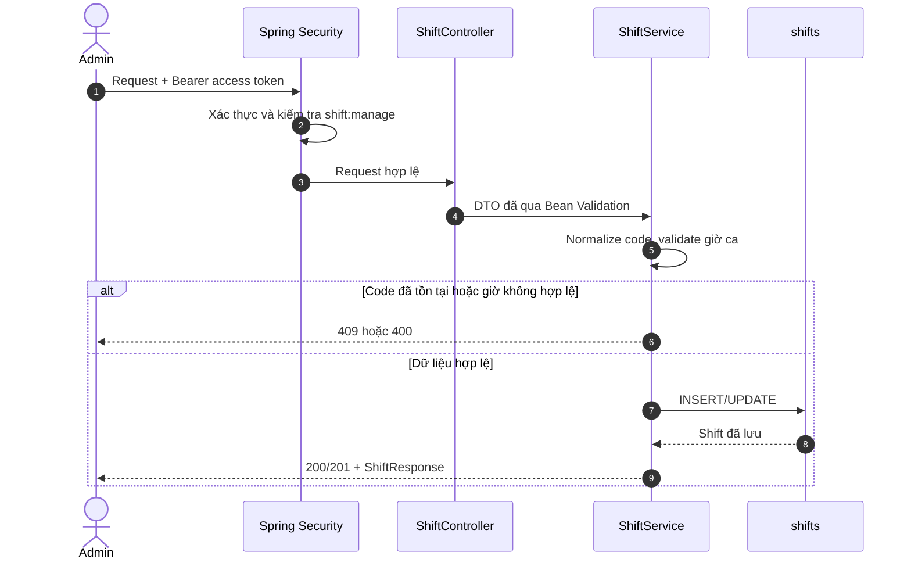
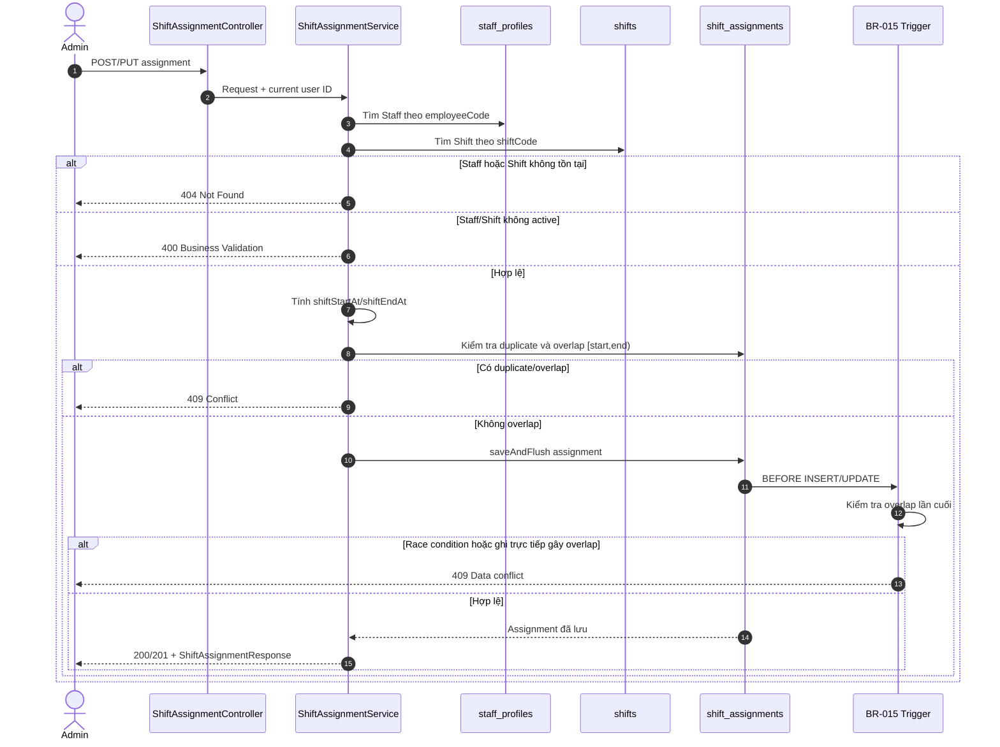

# BE-2.5 — Shifts & Shift Assignments

## 1. Mục tiêu và phạm vi

BE-2.5 cung cấp API cho Admin định nghĩa ca trực và phân công Staff vào ca theo ngày.

- `shifts` là cấu hình giờ làm việc hiện tại.
- `shift_assignments` là snapshot lịch đã phân công, gồm thời điểm bắt đầu và kết thúc thực tế.
- BR-014 yêu cầu người gọi có permission `shift:manage`.
- BR-015 không cho một Staff có hai assignment hiệu lực bị overlap.

## 2. API contract

Tất cả endpoint dưới đây cần access token hợp lệ và authority `shift:manage`. Quyền được kiểm tra tại controller và service.

| Method | Endpoint | Kết quả |
| --- | --- | --- |
| `GET` | `/api/shifts` | Danh sách tất cả ca, gồm cả ca không active |
| `GET` | `/api/shifts/{code}` | Chi tiết ca theo code |
| `POST` | `/api/shifts` | Tạo ca mới, trả `201 Created` |
| `PUT` | `/api/shifts/{code}` | Cập nhật ca, không thay đổi assignment đã tạo |
| `DELETE` | `/api/shifts/{code}` | Set `is_active=false`, trả `204 No Content` |
| `GET` | `/api/shift-assignments` | Danh sách assignment cơ bản |
| `GET` | `/api/shift-assignments/{publicId}` | Chi tiết assignment bằng UUID public |
| `POST` | `/api/shift-assignments` | Phân công Staff, mặc định `SCHEDULED` |
| `PUT` | `/api/shift-assignments/{publicId}` | Đổi Staff, ca, ngày, trạng thái hoặc ghi chú |
| `DELETE` | `/api/shift-assignments/{publicId}` | Set `status=CANCELLED`, trả `204 No Content` |

`POST /api/shift-assignments` nhận `employeeCode`, `shiftCode`, `workDate` và `note`. Client không được truyền `assignedBy`; backend lấy user ID từ JWT principal.

## 3. Flow quản lý Shift



Quy tắc thời gian:

- Ca thường: `crossesMidnight=false` và `endTime > startTime`.
- Ca qua đêm: `crossesMidnight=true` và `endTime <= startTime`.
- `startTime == endTime` luôn không hợp lệ.
- Xóa Shift chỉ vô hiệu hóa. Shift không active vẫn được đọc để giữ lịch sử nhưng không dùng cho assignment mới.
- Khi sửa giờ Shift, các assignment cũ giữ nguyên `shift_start_at` và `shift_end_at`; assignment tạo sau mới dùng giờ mới.

## 4. Flow phân công Staff



### Tính shift period

Timezone lấy từ `app.hotel.time-zone`, mặc định `Asia/Ho_Chi_Minh`.

Ví dụ ca thường:

```text
workDate       = 2026-08-19
startTime      = 06:00
endTime        = 14:00
shiftStartAt   = 2026-08-19T06:00:00+07:00
shiftEndAt     = 2026-08-19T14:00:00+07:00
```

Ví dụ ca đêm:

```text
workDate       = 2026-08-19
startTime      = 22:00
endTime        = 06:00
crossesMidnight = true
shiftStartAt   = 2026-08-19T22:00:00+07:00
shiftEndAt     = 2026-08-20T06:00:00+07:00
```

## 5. BR-015 — chống overlap

Các trạng thái giữ khoảng thời gian là `SCHEDULED` và `COMPLETED`. `ABSENT` và `CANCELLED` không chặn assignment khác.

Hai khoảng `[newStart, newEnd)` và `[existingStart, existingEnd)` overlap khi:

```text
newStart < existingEnd AND newEnd > existingStart
```

Vì dùng khoảng nửa mở, ca `06:00–14:00` và ca `14:00–22:00` được phép đứng liền nhau.

Backend kiểm tra trước ở service để trả lỗi rõ ràng. Hai trigger MySQL `trg_shift_assignments_before_insert` và `trg_shift_assignments_before_update` tiếp tục kiểm tra tại DB để chặn race condition hoặc lệnh ghi không đi qua API.

## 6. Response lỗi

| HTTP status | Trường hợp |
| --- | --- |
| `400` | DTO sai định dạng, giờ ca không hợp lệ, Staff/Shift không active |
| `401` | Thiếu hoặc sai access token |
| `403` | User không có `shift:manage` |
| `404` | Không tìm thấy Shift, Staff hoặc assignment |
| `409` | Trùng code, trùng Staff/Shift/ngày, hoặc overlap BR-015 |

`DELETE` không xóa vật lý. Assignment bị hủy vẫn có thể đọc qua API để giữ lịch sử phân công.
